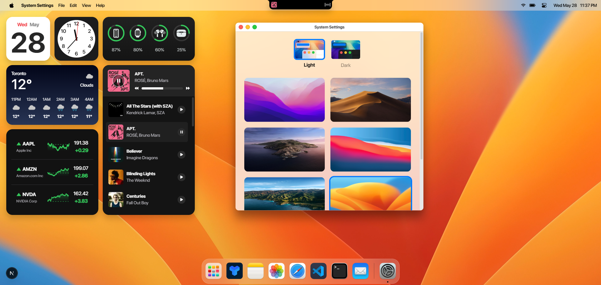
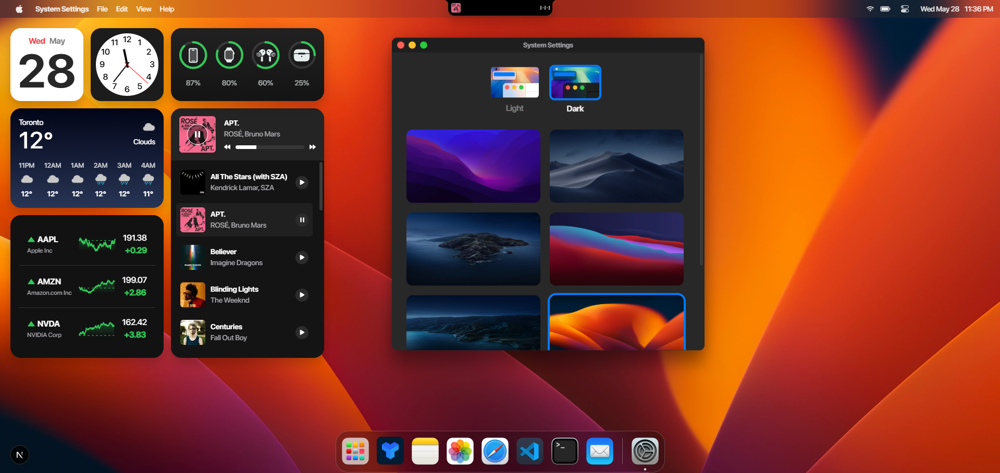

# macOS Portfolio

A stunning macOS-inspired portfolio website built with Next.js, featuring an authentic desktop experience with draggable windows, native-style applications, and smooth animations.




## Inspiration

Here are some websites that inspired me when creating this site:
- [Xiaohan Zou](https://portfolio.zxh.me/)
- [Anshuman](https://macosportfolio.netlify.app/)

## ✨ Features

- **Authentic macOS Interface**: Pixel-perfect recreation of macOS desktop environment
- **Interactive Desktop**: Draggable and resizable windows with native-style controls
- **Built-in Applications**: Portfolio showcase, contact form, music player, and more
- **Weather Integration**: Real-time weather display
- **Stock Market Data**: Live financial information display
- **Email Contact System**: Integrated contact form with email notifications
- **Theme Support**: Light and dark mode compatibility
- **Responsive Design**: Optimized for desktop and mobile devices
- **Smooth Animations**: Fluid transitions and micro-interactions using Framer Motion

## 🚀 Tech Stack

- **Framework**: Next.js 15.3.1 with React 19
- **Styling**: Tailwind CSS 4 with custom macOS-inspired components
- **Animations**: Framer Motion (motion)
- **State Management**: Zustand
- **Data Fetching**: TanStack Query with Axios
- **UI Components**: Radix UI primitives
- **Forms & Validation**: Zod validation
- **Email Service**: Nodemailer
- **Charts**: Recharts for data visualization
- **Image Handling**: React Photo View
- **Markdown Support**: React Markdown with syntax highlighting
- **Theme Management**: Next Themes

## 📦 Installation

1. **Clone the repository**
   ```bash
   git clone <your-repo-url>
   cd macos-portfolio
   ```

2. **Install dependencies**
   ```bash
   npm install
   ```

3. **Set up environment variables**
   
   Create a `.env.local` file in the root directory and add the following variables:
   
   ```env
   # Weather API (OpenWeatherMap or similar)
   NEXT_PUBLIC_WEATHER_API_KEY=your_weather_api_key
   
   # Stock Market API (Alpha Vantage)
   NEXT_PUBLIC_ALPHA_API_KEY=your_alpha_vantage_api_key
   
   # Location coordinates for weather
   NEXT_PUBLIC_LATTITUDE=your_latitude
   NEXT_PUBLIC_LONGITUDE=your_longitude
   
   # SMTP configuration for contact form
   NEXT_PUBLIC_SMTP_USER=your_email@gmail.com
   NEXT_PUBLIC_SMTP_PASS=your_app_password
   ```

4. **Run the development server**
   ```bash
   npm run dev
   ```

5. **Open your browser**
   
   Navigate to [http://localhost:3000](http://localhost:3000)

## 🔧 Configuration

### Weather Setup
1. Sign up for a free API key at [OpenWeatherMap](https://openweathermap.org/api)
2. Add your API key to `NEXT_PUBLIC_WEATHER_API_KEY`
3. Set your location coordinates in `NEXT_PUBLIC_LATTITUDE` and `NEXT_PUBLIC_LONGITUDE`

### Stock Market Data
1. Get a free API key from [Alpha Vantage](https://www.alphavantage.co/support/#api-key)
2. Add your API key to `NEXT_PUBLIC_ALPHA_API_KEY`

### Email Configuration
1. Set up an App Password for your Gmail account
2. Add your email and app password to the SMTP environment variables
3. The contact form will send emails through your configured SMTP server

## 🏗️ Project Structure

```
macos-portfolio/
├── components/          # Reusable UI components
├── pages/              # Next.js pages and API routes
├── public/             # Static assets
├── styles/             # Global styles and Tailwind config
├── lib/                # Utility functions and configurations
├── hooks/              # Custom React hooks
└── types/              # TypeScript type definitions
```

## 🎨 Key Components

- **Desktop Environment**: Authentic macOS desktop with dock, menu bar, and window management
- **Window System**: Draggable, resizable windows with minimize/maximize/close controls
- **Applications**: Built-in apps including portfolio, contact, calculator, and media player
- **Weather Widget**: Real-time weather information display
- **Stock Ticker**: Live financial market data
- **Contact Form**: Integrated email system for inquiries

## 🚀 Deployment

### Build for Production
```bash
npm run build
npm start
```

### Deploy to Vercel
1. Push your code to GitHub
2. Connect your repository to Vercel
3. Add your environment variables in Vercel dashboard
4. Deploy automatically on push

### Deploy to Netlify
1. Build the project: `npm run build`
2. Deploy the `out` folder to Netlify
3. Configure environment variables in Netlify dashboard

## 🛠️ Development

### Available Scripts
- `npm run dev` - Start development server
- `npm run build` - Build for production
- `npm run start` - Start production server
- `npm run lint` - Run ESLint

### Code Style
- TypeScript for type safety
- ESLint for code linting
- Tailwind CSS for styling
- Component-based architecture

## 🤝 Contributing

1. Fork the repository
2. Create a feature branch (`git checkout -b feature/amazing-feature`)
3. Commit your changes (`git commit -m 'Add amazing feature'`)
4. Push to the branch (`git push origin feature/amazing-feature`)
5. Open a Pull Request

## 📝 License

This project is licensed under the MIT License - see the [LICENSE](LICENSE) file for details.

## 🙏 Acknowledgments

- Inspired by the beautiful design of macOS Monterey
- Built with modern web technologies
- Icons and assets from various open-source projects

## 📧 Contact

For questions or support, please use the contact form within the portfolio or reach out through the configured email system.
